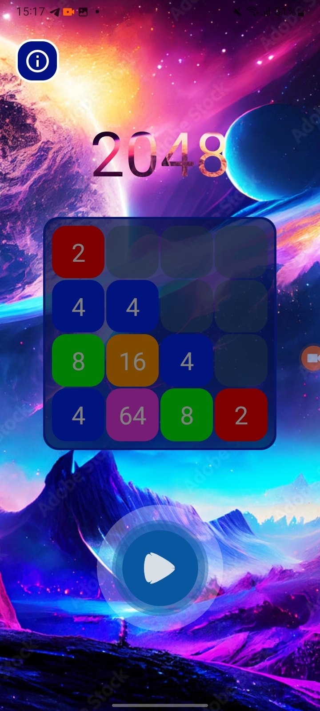

# 🌌 2048 Galaxy - Android Puzzle Game with Cosmic Vibes  

Embark on a stellar journey with **2048 Galaxy**, a captivating Android rendition of the classic 2048 puzzle game, infused with a mesmerizing galaxy-themed UI. Built using the Android framework with XML layouts, this game blends smooth gameplay, score tracking, continue functionality, and immersive background music to elevate the experience. The cosmic design features starry backgrounds, glowing tiles, and fluid animations, while custom TouchListener logic ensures intuitive swipe controls for tile merging.

---

## 🚀 Features
- **Galaxy-Themed UI**: Enchanting space-inspired design with starry backgrounds, vibrant tiles, and smooth animations crafted using XML layouts.  
- **Immersive Music**: Background music that complements the cosmic theme, enhancing the gaming experience.  
- **Smooth Gameplay**: Merge tiles to reach 2048 with intuitive swipe controls via Android's custom TouchListener.  
- **Score Tracking**: Persist and display high scores across sessions using SharedPreferences.  
- **Continue Functionality**: Seamlessly resume your game from where you left off.  
- **Responsive Design**: Optimized for various screen sizes with adaptive XML layouts.  

---

## 🎥 Demo
  

---

## 🖼️ Screenshots
    

---

## 📱 Download
👉 [Download APK](https://github.com/ksanjardev/2048/raw/master/app-debug.apk)  

---

## 🛠️ Tech Stack
- **Android Framework** (Java/Kotlin)  
- **XML** for UI design  
- **TouchListener** for swipe-based controls  
- **MediaPlayer** for background music playback  
- **SharedPreferences** for score and game state persistence  

---

## 🏁 Getting Started
1. Clone the repository: `git clone https://github.com/ksanjardev/2048.git`  
2. Open the project in Android Studio.  
3. Ensure music files are placed in `app/src/main/res/raw/`.  
4. Build and run: Use the `Run` button or `gradlew build` to generate the APK.  
5. Install the APK on your device or emulator.  
